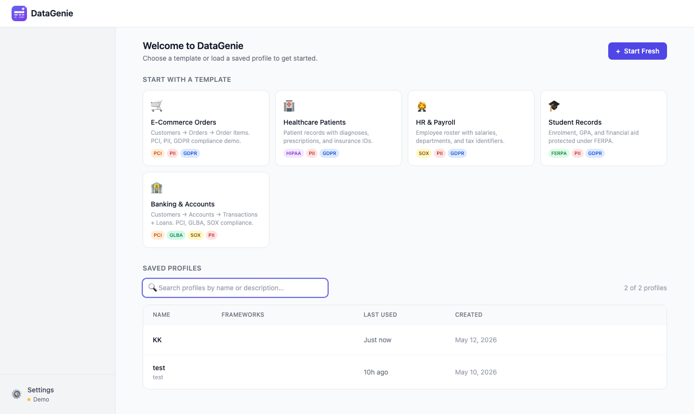
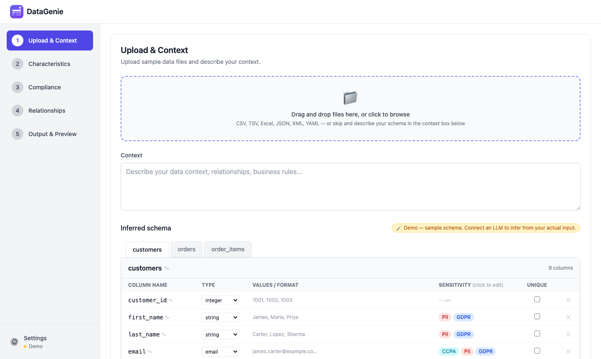
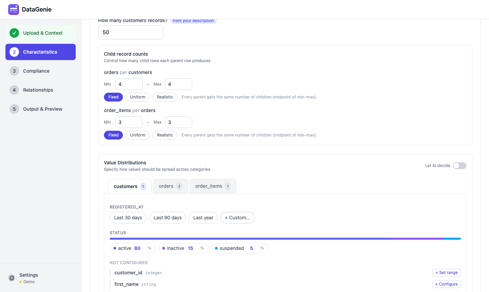
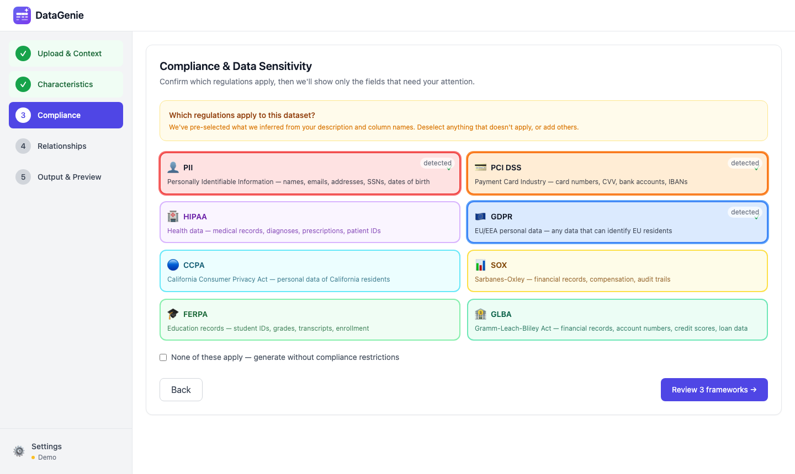
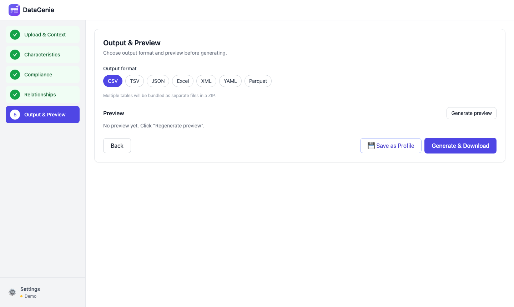
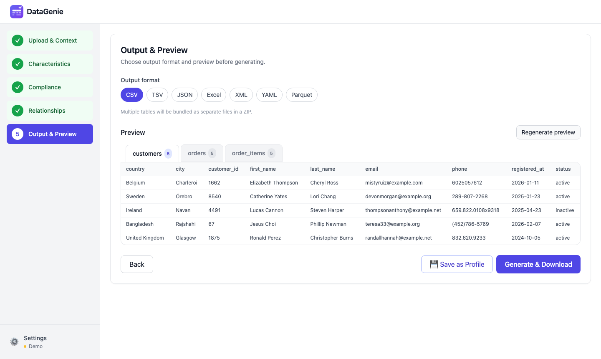
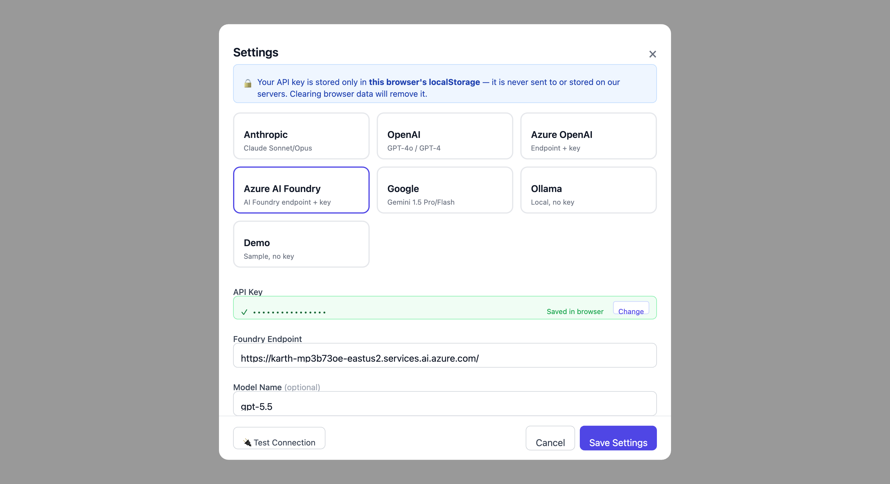

# 🪄 DataGenie — AI-Powered Synthetic Test Data Generator

DataGenie is a full-stack application that generates realistic, compliant synthetic test data from natural language descriptions or uploaded sample files. It infers schema, detects sensitive fields, enforces masking rules, and outputs data in multiple formats — all without your real data ever leaving your environment.

---

## 📋 Generation Workflow

| Stage | What happens |
|-------|-------------|
| **1 · Upload & Context** | Upload sample files and/or describe your data. DataGenie infers tables, columns, types, volume, and sensitivity. Edit schema inline using dog-ear tabs. |
| **2 · Characteristics** | Set total volume, variable child counts per parent (min/max/shape), numeric ranges, and categorical value distributions. |
| **3 · Compliance** | Auto-detected sensitive fields across 8 frameworks. Review and adjust per-field masking actions; write custom plain-English rules. *(Skipped if compliance is disabled in Settings or no sensitive fields detected.)* |
| **4 · Relationships** | Confirm or edit parent→child FK relationships (1:N, 1:1, N:N). *(Skipped for single-table schemas.)* |
| **5 · Output & Preview** | Pick a format, preview sample rows in tabbed view, then download. Multi-table schemas bundled as ZIP. |

---

## ✨ Features

### Schema Inference (Stage 1)
- **Natural language input** — describe your data in plain English and DataGenie infers tables, columns, types, volume, and compliance requirements
- **File upload** — upload CSV, TSV, Excel, JSON, XML, or YAML files; columns, types, and sample values are auto-extracted
- **Multi-table schema** — infers related tables from context with FK relationships and cardinality
- **Semantic type detection** — 100+ field catalog maps column names to real-world types (`email`, `phone`, `ssn`, `iban`, `dob`, `job_title`, etc.)
- **Dog-ear tabbed schema editor** — one table visible at a time when multiple tables are present; tabs auto-reset on re-infer
- **Inline column editing** — rename columns, change types, edit enum values, set date formats
- **Type suggestions** — auto-suggests a better type when a column name implies one (e.g. `created_at` → `date`)
- **Unique constraints** — auto-detected for identifiers (email, SSN, passport, IBAN, username, etc.); manually overrideable per column
- **Sensitivity tagging** — click any cell to add/remove compliance framework badges (PII, PCI, HIPAA, GDPR, etc.); auto-detected on column rename

---

### Characteristics (Stage 2)
- **Volume control** — set number of root-table rows; child tables scale automatically based on per-parent counts
- **Variable child record counts** — per child table min/max with three distribution shapes:
  - **Fixed** — every parent gets exactly the midpoint count
  - **Uniform** — random count drawn uniformly between min and max
  - **Realistic** — power-law skew toward lower counts (most parents have few children, a tail have many)
- **Numeric ranges** — configure min/max for `integer` and `float` columns
- **Value distributions** — set exact proportions for categorical (`string`/`enum`) columns with visual stacked proportion bar; percentages need not sum to 100
- **Dog-ear tabbed view** — per-table tabs for value distributions and ranges; badge shows count of configured columns
- **Quick mode** — "Let AI decide" toggle hands distribution decisions to the LLM

---

### Compliance & Masking (Stage 3)
- **8 regulatory frameworks** — PII, PCI DSS, HIPAA (all 18 PHI identifiers), GDPR (Art.9 special categories), CCPA, SOX, FERPA, GLBA
- **211-entry DLP field catalog** — rule-based detection covering all HIPAA 18 PHI, GDPR Art.9, PCI SAD, and GLBA fields
- **Per-field masking actions** — `fake_realistic`, `redact`, `hash`, `partial_mask`, `tokenize`, `age_shift`, `generalize`
- **Custom plain-English rules** — write a rule per field (*"replace with last 4 digits only"*) normalised to structured masking ops via LLM
- **Confidence scores** — LLM classifies each field and reports confidence; rule-based catalog is the fallback
- **Feature toggle** — disable the entire compliance feature in Settings for simpler use cases; hides sensitivity column, skips compliance stage entirely

---

### Relationships (Stage 4)
- **Parent→child direction** — relationships expressed as `Parent (1) → Child (N)`, e.g. `customers → orders`
- **Cardinality options** — 1:1, 1:N, N:N
- **Referential integrity** — FK values in child tables are sampled from parent table PKs
- **Duplicate & reverse detection** — prevents adding the same pair twice or contradictory A→B / B→A pairs
- **AI-detected relationships** — cross-file FK relationships auto-detected and pre-filled on infer

---

### Output (Stage 5)
- **7 export formats** — CSV, TSV, JSON, Excel (.xlsx), XML, YAML, Parquet
- **JSON style options** — Array of objects, Nested, or JSON Lines (one record per line)
- **XML structure options** — configurable root element and row element names
- **Multi-table ZIP** — when schema has multiple tables, all files are bundled in a single ZIP
- **Dog-ear tabbed preview** — see sample rows per table before downloading; row count badge on each tab
- **Preview regeneration** — re-run preview after editing any earlier stage

---

### Settings
- **Sidebar placement** — Settings button consistently at the bottom-left on every screen
- **6 LLM providers** — Anthropic, OpenAI, Azure OpenAI, Google, Ollama, Demo
- **Per-provider key storage** — switching providers restores that provider's previously saved key/model/extras
- **Compliance feature toggle** — turn off regulatory compliance globally for simpler workflows
- **Test connection** — verify API key before saving

---

### App Shell
- **Fixed sidebar, scrollable content** — sidebar stays locked; only the main area scrolls
- **Stage locking** — stages 2–5 are locked until a schema is inferred ("infer schema first" tooltip)
- **Consistent headers** — identical top bar height across all screens

---

### Home Screen & Starter Templates
- **Profile picker home screen** — consistent sidebar layout with Settings pinned at bottom-left
- **5 demo templates** — instantly load a fully-configured multi-table schema; works in all modes including Demo
- **Saved profiles** — reload any previous generation config (schema + compliance + output settings) with one click; searchable by name

| Template | Schema | Frameworks |
|----------|--------|------------|
| 🛒 **E-Commerce Orders** | `customers → orders → order_items` | PCI, PII, GDPR |
| 🏥 **Healthcare Patients** | `patients → visits + prescriptions` | HIPAA, PII, GDPR |
| 👩‍💼 **HR & Payroll** | `employees → leave_requests` | SOX, PII, GDPR |
| 🎓 **Student Records** | `students → enrollments` | FERPA, PII, GDPR |
| 🏦 **Banking & Accounts** | `customers → accounts → transactions + loans` | PCI, GLBA, SOX, PII |

---

## 🤖 LLM Configuration

Open **Settings (⚙️)** from the sidebar bottom-left. Config is stored in `localStorage` — no server-side storage.

| Provider | Notes |
|---|---|
| **Anthropic** | Claude Sonnet / Opus — recommended for best schema inference |
| **OpenAI** | GPT-4o / GPT-4 Turbo |
| **Azure OpenAI** | Requires endpoint and deployment name |
| **Google** | Gemini 1.5 Pro / Flash |
| **Ollama** | Local models (e.g. `llama3`), no API key needed |
| **Demo** | No API key — rule-based inference only |

---

## 🏗 Architecture

```
datagenie/
├── frontend/                        # React 18 + Vite + Tailwind CSS
│   └── src/
│       ├── api/client.js            # API client with fetchWithRetry
│       ├── components/
│       │   ├── Stage1_Upload/       # File upload + schema editor (dog-ear tabs, unique, sensitivity)
│       │   ├── Stage2_Characteristics/  # Volume, variable child counts, ranges, distributions
│       │   ├── Stage3_Compliance/   # Framework detection, per-field masking, custom rules
│       │   ├── Stage4_Relationships/    # Parent→child FK editor (1:N, 1:1, N:N)
│       │   ├── Stage5_Output/       # Format picker, tabbed preview, download
│       │   ├── Profiles/            # Save / load / search named profiles
│       │   ├── Settings/            # LLM provider + compliance feature toggle
│       │   └── common/              # StageIndicator, Spinner, ChipSelector
│       ├── store/appStore.js        # Zustand global state
│       └── utils/llmStorage.js     # localStorage: LLM config + app settings
│
├── backend/                         # FastAPI + SQLAlchemy (async)
│   ├── routers/
│   │   ├── schema.py    # POST /infer, GET /demo, POST /normalize-rule
│   │   ├── generate.py  # POST /generate, POST /preview
│   │   ├── profiles.py  # CRUD for saved profiles
│   │   └── settings.py  # LLM settings + test connection
│   └── services/
│       ├── llm_service.py           # Multi-provider LLM abstraction
│       ├── context_extractor.py     # NL → structured schema params
│       ├── compliance_detector.py   # 211-entry DLP catalog, 8 frameworks, LLM batch
│       ├── data_generator.py        # Faker-based engine: FK integrity, unique constraints, variable child counts
│       ├── demo_templates.py        # 5 multi-table + 4 single-table canned schemas
│       ├── output_formatter.py      # CSV/TSV/JSON/JSONL/Excel/XML/YAML/Parquet
│       ├── masking.py               # Plain-English rule → structured MaskingOp
│       ├── schema_inferrer.py       # File-based column type + stats inference
│       └── file_parser.py           # CSV/Excel/JSON/XML/YAML → normalised rows
│
├── docker-compose.yml               # Full stack (postgres + backend + frontend/nginx)
└── nginx.conf                       # Reverse proxy: /api → backend, / → frontend
```

---

## 🛠 Tech Stack

| Layer | Technology |
|---|---|
| Frontend | React 18, Vite 5, Tailwind CSS 3, Zustand |
| Backend | FastAPI, SQLAlchemy 2 (async), Uvicorn |
| Database | PostgreSQL 15 |
| Data generation | Faker, pandas, openpyxl, pyarrow |
| LLM providers | Anthropic, OpenAI, Azure OpenAI, Google Generative AI, Ollama |
| Containerisation | Docker, Docker Compose, nginx |

---

## 🚀 Quick Start

### Prerequisites
- Docker & Docker Compose

### Production (Docker)

```bash
git clone git@github.com:karthik-krishnan/datagenie.git
cd datagenie
docker-compose up --build
```

Open **http://localhost:3001** | API docs: **http://localhost:8000/docs**

> ⚠️ `docker-compose.yml` bakes code into the image — you must `docker-compose build backend && docker-compose up -d backend` after every backend Python change.

### Development (hot reload)

```bash
# Start postgres + backend with hot reload
docker-compose -f docker-compose.yml -f docker-compose.dev.yml up -d --build

# Frontend with Vite HMR (run separately)
cd frontend && npm install && npm run dev   # → http://localhost:3001
```

Or run natively without Docker:

```bash
# Terminal 1 — backend
cd backend && pip install -r requirements.txt
uvicorn main:app --reload --port 8000

# Terminal 2 — frontend
cd frontend && npm install && npm run dev   # → http://localhost:3001
```

The Vite dev server proxies `/api/*` to `http://localhost:8000` automatically.

---

## 📸 Screenshots

| | |
|---|---|
|  |  |
| **Starter templates** — pick a pre-built multi-table schema | **Schema editor** — dog-ear tabs per table, type + sensitivity editing |
|  |  |
| **Characteristics** — volume, variable child counts, ranges | **Value distributions** — visual proportion chips per enum column |
|  |  |
| **Compliance review** — per-field masking across 8 frameworks | **Relationships** — parent→child (1:N) FK editor |
|  |  |
| **Output preview** — tabbed multi-table data preview | **Settings** — LLM provider + compliance feature toggle |

---

## 🗒 Notes

- **No data leaves your environment** when using Ollama or self-hosting. With cloud providers, only column names and sample values are sent — never full dataset rows.
- **Demo mode** works fully without any API key — all 5 starter templates load instantly and schema inference uses rule-based detection.
- **Compliance is optional** — disable it in Settings to skip sensitivity tagging and the compliance stage entirely.
- The `/api/schema/infer` endpoint never falls back to demo templates. Starter cards use a dedicated `/api/schema/demo` endpoint.
